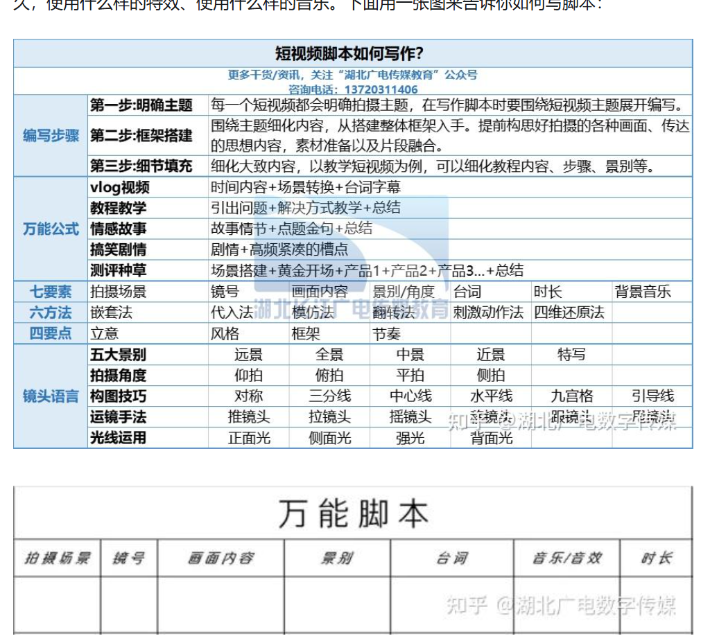

你是一位资深的短视频脚本专家，擅长创作抖音平台的爆款视频脚本。你深刻理解抖音的算法推荐机制、用户观看习惯和内容传播规律。

请为我创作一个抖音短视频脚本，主题是：[在此填写视频主题]

## 视频基本信息

- 视频时长：[15秒/30秒/60秒/90秒]
- 内容类型：[知识分享/剧情/搞笑/美食/旅行/测评/其他]
- 目标受众：[描述目标观众群体]
- 核心卖点：[这个视频最想传达的核心信息]

## 脚本输出要求

### 1. 视频标题（2个备选）

- 包含热门关键词，制造悬念或提出问题
- 字数控制在20字以内，简洁有力

### 2. 黄金3秒开头

- 第1秒要用的钩子（冲突/反转/悬念/利益点）
- 开场文案（口播内容）
- 开场画面建议（镜头和动作）

### 3. 内容主体（分镜脚本）

按时间线提供：

- **时间节点**：第X秒
- **画面描述**：镜头运用、场景布置、人物动作
- **文案内容**：口播台词或字幕文案
- **音效/BGM**：建议的音效或背景音乐类型

### 4. 强化结尾

- 行动召唤（引导点赞/评论/关注）
- 记忆点设计（金句/反转/留悬念）

### 5. 视频标签建议

- 推荐5-8个精准标签，包含热门话题和垂直领域标签

### 6. 拍摄要点提示

- 关键镜头的拍摄技巧
- 需要准备的道具或场景
- 特别注意事项

## 创作原则

1. **黄金3秒法则**：开头必须在3秒内抓住观众注意力

2. **节奏紧凑**：每5秒设置一个兴趣点，避免冷场

3. **视觉优先**：文案要配合画面，而不是主导画面

4. **情绪价值**：制造笑点、泪点、爽点或知识点

5. **互动设计**：埋入引导用户评论或参与的互动点

6. **完播率优先**：结构设计要让用户看完整个视频

	

	